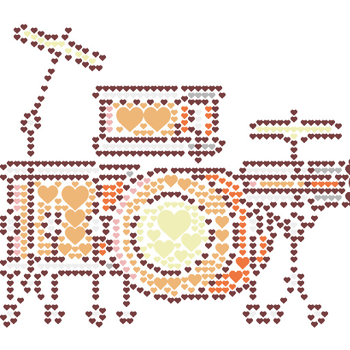
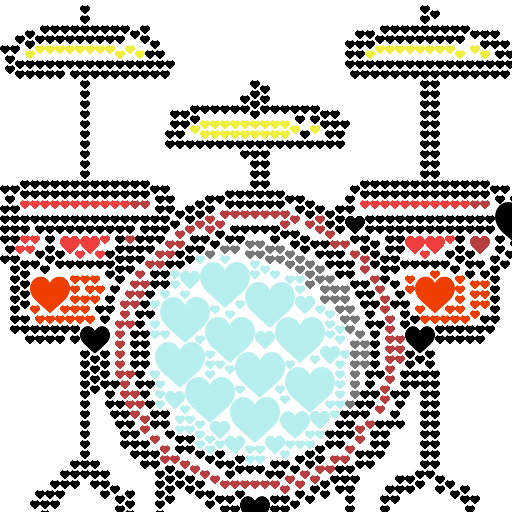

👷 Build images with images.

## About

Tiler is a tool to create an image using all kinds of other smaller images (tiles). It is different from other mosaic tools since it can adapt to tiles with multiple shapes and sizes (i.e. not limited to squares).

An image can be built out of circles, lines, waves, cross stitches, legos, minecraft blocks, paper clips, letters, ... The possibilities are endless!

## Installation

- Clone the repo: `git clone https://github.com/nuno-faria/tiler.git`;
- Install Python 3;
- Install pip (optional, to install the dependencies);
- Install dependencies: `pip install -r requirements.txt`

## Usage

- Make a folder with the tiles (and only the tiles) to build the image;
    - The script `gen_tiles.py` can help in this task; it builds tiles with multiple colors based on the source tile (note: its recommended for the source file to have an RGB color of (240,240,240)). It is used as `python gen_tiles.py path/to/image` and creates a folder with a 'gen_' prefix in the same path as the base image.
- Run `python tiler.py path/to/image path/to/tiles_folder/`.
  * For example, `python tiler.py band.png tiles/hearts/gen_heart/` is trying to use heart tiles to modify image "band.png"

## Configuration

All configurations can be changed in the `conf.py` file.

#### `gen_tiles.py`

- `DEPTH` - number of divisions in each color channel (ex: DEPTH = 4 -> 4 * 4 * 4 = 64 colors);
- `ROTATIONS` - list of rotations, in degrees, to apply over the original image (ex: [0, 90]).

#### `tiler.py`

- `COLOR_DEPTH` - number of divisions in each color channel (ex: COLOR_DEPTH = 4 -> 4 * 4 * 4 = 64 colors);
- `RESIZING_SCALES` - scale to apply to each tile (ex: [1, 0.75, 0.5, 0.25]);
- `PIXEL_SHIFT` - number of pixels shifted to create each box (ex: (5,5)); if None, shift will be the same as the tile dimension);
    
- `OVERLAP_TILES` - if tiles can overlap;
- `RENDER` - render image as its being built;
- `POOL_SIZE` - multiprocessing pool size;
- `IMAGE_TO_TILE` - image to tile (ignored if passed as the 1st arg);
- `TILES_FOLDER` - folder with tiles (ignored if passed as the 2nd arg);
- `OUT` - result image filename.

## Examples

* The way it works is by finding close colors as an area, then fill each area with the tile closest to that color.

### Example 1
* Run `python tiler.py drum.png tiles/hearts/gen_heart/`

        

### Example 2
* Run `python tiler.py drum-set.png tiles/hearts/gen_heart/`

        
